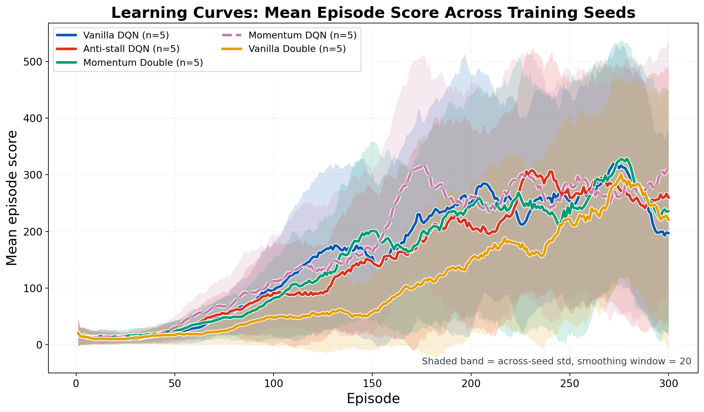
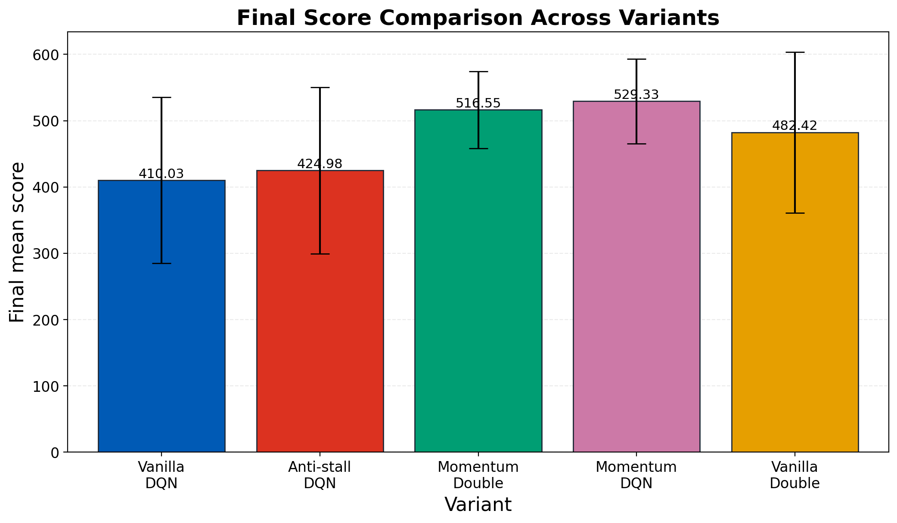
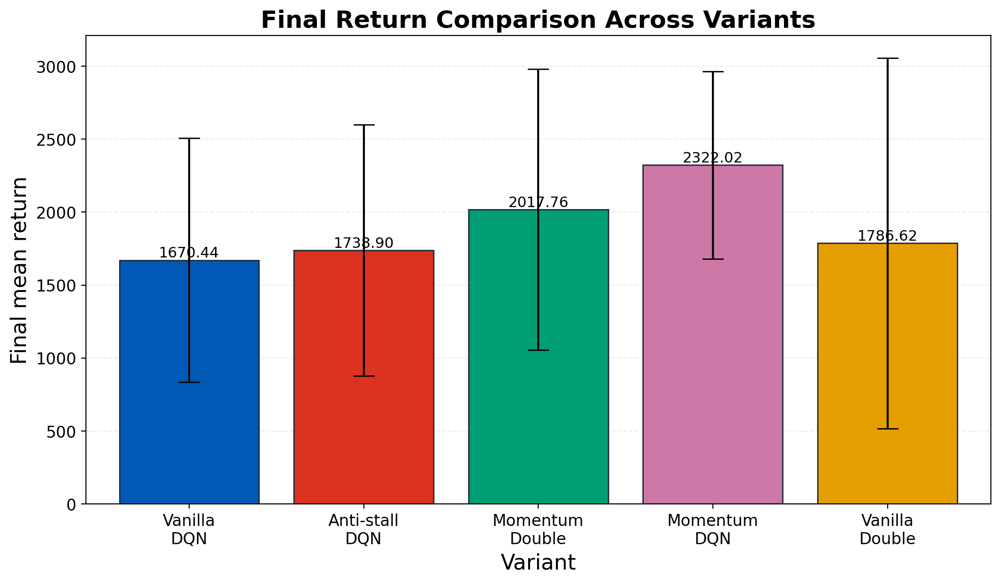
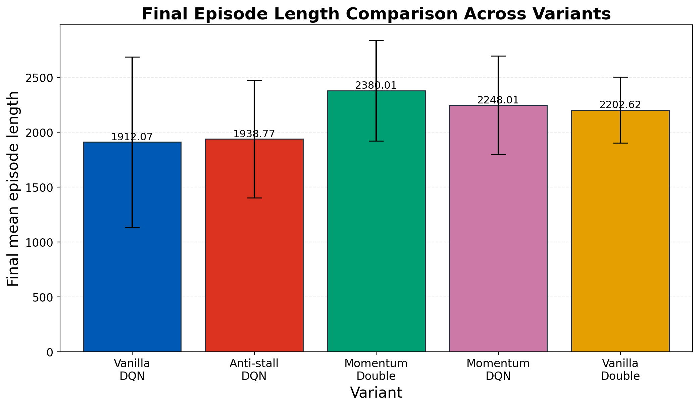
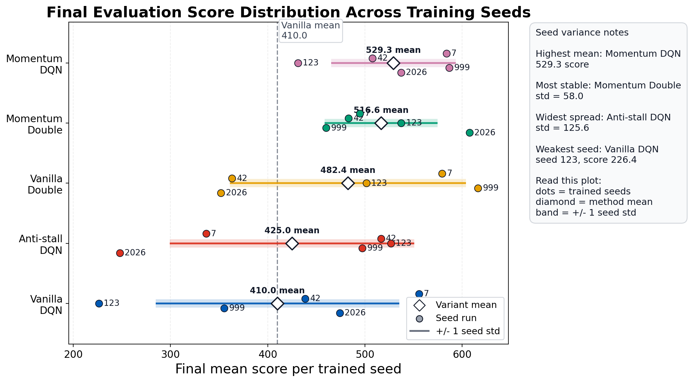

# Deep Q-Learning Variations for Hill Climb Racing

**Name:**

## Abstract

This study evaluates Deep Q-Network based reinforcement learning methods on a physics-based Hill Climb Racing control task. The project uses a reused Gymnasium-compatible Hill Climb Racing simulator as the environment layer and implements a separate DQN training and evaluation pipeline in `hcr_dqn`. The baseline method is a standard DQN trained with a discrete three-action control space. Four additional variants are evaluated: Momentum DQN, Vanilla DoubleDQN, Momentum DoubleDQN, and Anti-stall Momentum DQN. The experiments use five training seeds per completed variant and report final performance on 30 held-out evaluation episodes using seeds 10000 to 10029. Momentum DQN achieved the highest mean final score, with a mean score of 529.33 and mean return of 2322.02. Momentum DoubleDQN achieved the lowest final-score standard deviation, with a score standard deviation of 58.04, and the longest mean episode length, with a mean length of 2380.01 steps. Anti-stall Momentum DQN did not improve over the previous momentum-based variants; it achieved a mean final score of 424.98 and a score standard deviation of 125.59. Visual checkpoint inspection showed that several agents still became stuck on elevated terrain or survived without useful recovery. The final result indicates that momentum-sensitive reward shaping improved average performance, while DoubleDQN improved consistency when combined with the same reward shaping. The anti-stall reward branch was discontinued because it produced weaker numerical results and unstable recovery behavior.

## 1. Introduction

Reinforcement learning is a learning framework in which an agent improves its behavior through interaction with an environment. At each step, the agent observes the current state, selects an action, receives a reward, and moves to a new state. The objective is to learn a policy that maximizes long-term reward. This project applies reinforcement learning to a Hill Climb Racing environment, where the agent controls a vehicle over uneven terrain.

The Hill Climb Racing task is difficult because the environment is governed by vehicle physics. The agent must move forward, maintain balance, avoid flipping, and handle slopes that can cause the vehicle to stall. The same action can be useful on flat terrain but harmful on steep terrain. A policy that applies gas aggressively may move quickly at first but flip or overshoot later. A policy that survives for a long time may still fail to make progress if the vehicle becomes stuck. For this reason, the task requires evaluation of both numerical performance and visible behavior.

The project has three main goals. The first goal is to implement a standard DQN baseline for the Hill Climb Racing task. The second goal is to evaluate whether momentum-sensitive reward shaping improves performance over the baseline. The third goal is to evaluate whether DoubleDQN improves learning stability by changing the temporal-difference target. A final anti-stall variation was tested after earlier agents showed a repeated failure mode: getting stuck on elevated terrain and taking little useful recovery action.

Figure 1. Hill Climb Racing environment during checkpoint playback, showing the vehicle, terrain, and control task.

## 2. Related Work

Deep Q-Networks combine Q-learning with neural networks to approximate action values in state spaces that are too large for tabular Q-learning. A DQN estimates the value of each available action from the current state and selects actions using an exploration strategy such as epsilon-greedy action selection. Standard DQN also uses experience replay and a target network to reduce instability during learning [1].

DoubleDQN addresses overestimation bias in standard DQN. In the standard DQN target, the max operator uses estimated Q-values to select the next action and evaluate the value of that action. If some Q-values are overestimated, the max operator can repeatedly select overly optimistic actions. DoubleDQN separates action selection from action evaluation: the online network selects the next action, and the target network evaluates that selected action [2].

Reward shaping modifies the reward used for learning while keeping the same environment task. In this project, reward shaping is used to create the Momentum DQN and Anti-stall Momentum DQN variants. These variants do not change the action space, Q-network architecture, replay buffer, or optimizer. They change the learning reward so that forward momentum, stable driving, and recovery behavior can be encouraged or discouraged more directly than with the base distance reward alone.

## 3. Methodology

### 3.1 Project Structure

The project separates the reused simulator from the reinforcement learning implementation. The `hillclimbracing/` directory contains the Hill Climb Racing environment. The `hcr_dqn/` directory contains the DQN implementation, configuration, training loop, evaluation scripts, plotting code, and checkpoint playback tools. The `runs/` directory stores training outputs, checkpoints, and log files. The `plots/` directory stores aggregate plots and CSV files generated from completed runs.

Figure 2. Project structure and experiment pipeline.  
The simulator layer is `hillclimbracing/`; the reinforcement learning layer is `hcr_dqn/`; training outputs are written to `runs/`; aggregate results and figures are written to `plots/`.

### 3.2 Environment

The DQN code uses the Gymnasium environment:

```text
hill_racing_env/HillRacing-v0
```

The main experiments use a discrete action space:

| Action index | Action meaning |
|---:|---|
| 0 | idle |
| 1 | gas |
| 2 | reverse |

The environment configuration used for the main experiments is:

| Environment setting | Value |
|---|---|
| `action_space` | `discrete_3` |
| `reward_function` | `distance` |
| `reward_type` | `soft` |
| `max_episode_steps` | 3000 |

The primary final evaluation metric is game score. The game score reflects forward progress and is taken from the environment information dictionary during evaluation. Mean return and mean episode length are reported as supporting metrics.

### 3.3 State Representation

The Hill Climb Racing environment returns a dictionary observation. The DQN implementation uses `hcr_dqn/env_wrappers.py` to flatten this dictionary into a fixed seven-dimensional numeric vector:

```text
[chassis_x,
 chassis_y,
 chassis_angle_deg,
 back_wheel_speed,
 front_wheel_speed,
 back_wheel_on_ground,
 front_wheel_on_ground]
```

This representation includes position, chassis angle, wheel speed, and wheel-ground contact. These features are relevant to forward progress, balance, stalling, airborne behavior, and flipping.

### 3.4 Q-Network and DQN Agent

The Q-network is implemented in `hcr_dqn/q_network.py`. It is a feedforward multilayer perceptron with two hidden layers. The default hidden layer sizes are `(128, 128)`, and ReLU activations are used between linear layers. The network input dimension is 7, matching the flattened observation vector. The output dimension is 3, matching the number of discrete actions.

The baseline DQN agent is implemented in `hcr_dqn/dqn_agent.py`. It uses:

- an online Q-network;
- a target Q-network;
- epsilon-greedy action selection;
- an experience replay buffer;
- minibatch updates from replayed transitions;
- periodic target-network synchronization;
- checkpoint saving and loading.

For non-terminal transitions, the standard DQN target is:

```text
y = r + gamma * max_a Q_target(s_next, a)
```

This target is used when `td_target_mode = "dqn"`.

### 3.5 DoubleDQN Target Rule

The implementation separates the reward style from the temporal-difference target rule. The configuration field `agent_variant` controls the reward style, and the field `td_target_mode` controls whether the agent uses the standard DQN target or the DoubleDQN target.

The allowed target modes are:

```text
dqn
double_dqn
```

When `td_target_mode = "double_dqn"`, the online network selects the best next action:

```text
next_action = argmax_a Q_online(s_next, a)
```

The target network then evaluates that selected action:

```text
y = r + gamma * Q_target(s_next, next_action)
```

This changes only the target calculation. The replay buffer, Q-network architecture, optimizer, epsilon schedule, and evaluation protocol are kept the same as the baseline unless the agent variant changes the reward.

### 3.6 Momentum-Sensitive Reward Shaping

Momentum DQN uses the same core DQN structure as the baseline, but stores a shaped reward in the replay buffer. The shaped reward is implemented by `MomentumSensitiveDQNAgent` in `hcr_dqn/dqn_agent.py`. The purpose is to encourage useful forward driving behavior and discourage unstable or unproductive behavior.

The momentum-sensitive reward includes:

- a forward momentum bonus when the vehicle makes consistent forward progress;
- a stall penalty when the vehicle has little useful progress for too long;
- an oscillation penalty when the agent repeatedly switches between opposite drive actions without progress;
- a chassis-angle penalty when the car tilts beyond a stable range;
- an airborne penalty when both wheels leave the ground;
- a back-wheel-only penalty when the car relies too much on unstable rear-wheel balancing.

The main momentum-sensitive reward parameters are:

| Parameter | Value |
|---|---:|
| `momentum_bonus_scale` | 0.05 |
| `momentum_stall_penalty` | 0.02 |
| `momentum_oscillation_penalty` | 0.02 |
| `momentum_forward_streak_required` | 3 |
| `momentum_stall_patience` | 30 |
| `momentum_progress_clip` | 5.0 |
| `momentum_angle_limit_deg` | 45.0 |
| `momentum_angle_penalty_scale` | 0.001 |
| `momentum_air_penalty` | 0.01 |
| `momentum_back_wheel_penalty` | 0.005 |

Momentum DQN is configured as:

```text
agent_variant = "momentum_sensitive"
td_target_mode = "dqn"
```

### 3.7 Anti-Stall Momentum Reward

Anti-stall Momentum DQN extends Momentum DQN with a stronger penalty for prolonged low-progress states. The motivation came from visual checkpoint observations: Momentum DQN and Momentum DoubleDQN sometimes became stuck on elevated terrain and did not take useful recovery actions.

The anti-stall reward parameters are:

| Parameter | Value |
|---|---:|
| `anti_stall_patience` | 20 |
| `anti_stall_progress_threshold` | 0.01 |
| `anti_stall_idle_penalty` | 0.08 |
| `anti_stall_reverse_penalty` | 0.05 |
| `anti_stall_gas_penalty` | 0.005 |
| `anti_stall_penalty_growth` | 0.002 |
| `anti_stall_penalty_cap` | 0.25 |
| `anti_stall_gas_recovery_bonus` | 0.03 |

Anti-stall Momentum DQN is configured as:

```text
agent_variant = "antistall_momentum"
td_target_mode = "dqn"
```

The method was evaluated as a DQN variant first so that the reward change could be isolated before combining it with DoubleDQN. The planned Anti-stall Momentum DoubleDQN follow-up was cancelled because the DQN version did not improve the previous momentum-based methods.

### 3.8 Experiment Variants

The experiment design treats reward style and target mode as separate choices:

| Method | `agent_variant` | `td_target_mode` | Description |
|---|---|---|---|
| Vanilla DQN | `vanilla` | `dqn` | Standard DQN with original environment reward |
| Momentum DQN | `momentum_sensitive` | `dqn` | Standard DQN with momentum-sensitive shaped reward |
| Vanilla DoubleDQN | `vanilla` | `double_dqn` | DoubleDQN target rule with original environment reward |
| Momentum DoubleDQN | `momentum_sensitive` | `double_dqn` | DoubleDQN target rule with momentum-sensitive shaped reward |
| Anti-stall Momentum DQN | `antistall_momentum` | `dqn` | Momentum reward plus explicit stuck-recovery penalty |
| Anti-stall Momentum DoubleDQN | `antistall_momentum` | `double_dqn` | Cancelled after Anti-stall Momentum DQN underperformed |

### 3.9 Training Protocol

Each completed variant was trained with five training seeds:

```text
7, 42, 123, 999, 2026
```

The main training hyperparameters were:

| Hyperparameter | Value |
|---|---:|
| Number of training episodes | 300 |
| Maximum episode steps | 3000 |
| Discount factor `gamma` | 0.99 |
| Learning rate | 0.001 |
| Batch size | 64 |
| Hidden layer sizes | 128, 128 |
| Epsilon start | 1.0 |
| Epsilon end | 0.05 |
| Epsilon decay | 0.995 |
| Target update frequency | 1000 steps |
| Validation frequency | every 25 episodes |
| Validation episodes | 10 |

During training, validation evaluation is run every 25 episodes. The best checkpoint is selected using validation mean score and saved as `best_model.pt`.

### 3.10 Evaluation Protocol

The project uses separate validation and final evaluation stages:

| Evaluation stage | Purpose | Seed range | Number of episodes | Exploration |
|---|---|---|---:|---|
| Validation | Checkpoint selection during training | 1000 to 1009 | 10 | Off |
| Final evaluation | Held-out reporting after training | 10000 to 10029 | 30 | Off |

Final evaluation results are stored in:

```text
runs/<run_name>/logs/evaluation_summaries.csv
runs/<run_name>/logs/evaluation_episode_details.csv
```

The aggregate report tables and plots are generated from:

```text
plots/aggregate_final_evaluation_metrics.csv
plots/per_run_final_evaluation_metrics.csv
```

Training curves are used to describe learning behavior. Final evaluation metrics are used for final performance claims.

## 4. Results

### 4.1 Learning Curves



Figure 3 shows the mean training episode score across available seeds for each variant. The curve is based on `episode_score` from `training_metrics.csv` and uses a moving average smoothing window. The training curve describes learning behavior during training, but it is not the final held-out performance metric.

### 4.2 Aggregate Final Evaluation Results

Table 1 reports aggregate final evaluation results across five training seeds per completed variant. Final evaluation used 30 held-out episodes with seeds 10000 to 10029.

| Variant | Runs | Mean score | Score std | Mean return | Return std | Mean length | Length std |
|---|---:|---:|---:|---:|---:|---:|---:|
| Vanilla DQN | 5 | 410.03 | 125.32 | 1670.44 | 836.05 | 1912.07 | 776.13 |
| Anti-stall Momentum DQN | 5 | 424.98 | 125.59 | 1738.90 | 859.53 | 1938.77 | 535.12 |
| Vanilla DoubleDQN | 5 | 482.42 | 121.38 | 1786.62 | 1270.88 | 2202.62 | 300.24 |
| Momentum DoubleDQN | 5 | 516.55 | 58.04 | 2017.76 | 962.93 | 2380.01 | 457.55 |
| Momentum DQN | 5 | 529.33 | 64.10 | 2322.02 | 642.37 | 2248.01 | 448.21 |

Momentum DQN achieved the highest mean final score and mean final return. Momentum DoubleDQN achieved the lowest final-score standard deviation and the longest mean episode length. Anti-stall Momentum DQN performed only slightly above Vanilla DQN in mean score and did not improve consistency.

### 4.3 Final Score Comparison



Figure 4 compares mean final score across variants. Momentum DQN achieved the highest mean score at 529.33. Momentum DoubleDQN achieved the second-highest mean score at 516.55. Vanilla DoubleDQN achieved 482.42, which is higher than Vanilla DQN at 410.03. Anti-stall Momentum DQN achieved 424.98, which is lower than the earlier momentum-based variants and close to the baseline.

The difference between Momentum DQN and Vanilla DQN is 119.30 score points. This is a 29.10% increase relative to Vanilla DQN. Momentum DoubleDQN improved over Vanilla DoubleDQN by 34.13 score points, which is a 7.08% increase relative to Vanilla DoubleDQN.

### 4.4 Final Return Comparison



Figure 5 compares mean final return. Momentum DQN achieved the highest mean return at 2322.02. Momentum DoubleDQN followed with 2017.76. Vanilla DoubleDQN achieved 1786.62, and Vanilla DQN achieved 1670.44. Anti-stall Momentum DQN achieved 1738.90.

The return results show that the momentum-sensitive reward improved the reward signal used for learning. Momentum DQN improved mean return over Vanilla DQN by 651.58 points, a 39.01% increase relative to Vanilla DQN. Anti-stall Momentum DQN did not improve over Momentum DQN; it was lower by 583.13 return points.

### 4.5 Final Episode Length Comparison



Figure 6 compares mean episode length during final evaluation. Momentum DoubleDQN had the longest mean episode length at 2380.01 steps. Momentum DQN had a mean length of 2248.01 steps. Vanilla DoubleDQN had a mean length of 2202.62 steps. Anti-stall Momentum DQN had a mean length of 1938.77 steps, and Vanilla DQN had a mean length of 1912.07 steps.

Episode length must be interpreted together with score and visual behavior. A long episode can indicate survival, but it can also indicate stalled survival if the car remains alive without useful forward progress. Momentum DoubleDQN had the longest mean episode length, but checkpoint watching showed that some long episodes still included stuck behavior.

### 4.6 Seed Variance



Figure 7 shows the distribution of final mean score across training seeds. Each dot represents one trained seed, the white diamond represents the across-seed mean, and the horizontal band represents plus or minus one across-seed standard deviation. Momentum DoubleDQN had the lowest score standard deviation at 58.04. Momentum DQN had a score standard deviation of 64.10. Vanilla DQN, Vanilla DoubleDQN, and Anti-stall Momentum DQN had much larger score standard deviations of 125.32, 121.38, and 125.59 respectively.

Momentum DoubleDQN reduced score standard deviation relative to Momentum DQN by 6.06 points, which is a 9.45% reduction. Compared with Vanilla DQN, Momentum DoubleDQN reduced score standard deviation by 67.29 points, which is a 53.69% reduction.

### 4.7 Per-Seed Final Evaluation Results

Table 2 reports the final evaluation result for each trained seed. Each row is the mean over 30 final evaluation episodes.

| Variant | Training seed | Mean score | Score std | Mean return | Return std | Mean length | Length std |
|---|---:|---:|---:|---:|---:|---:|---:|
| Vanilla DQN | 7 | 555.60 | 183.31 | 2594.00 | 990.01 | 2146.73 | 780.78 |
| Vanilla DQN | 42 | 438.63 | 99.97 | 2131.13 | 1854.54 | 2804.63 | 426.88 |
| Vanilla DQN | 123 | 226.43 | 46.81 | 849.83 | 194.03 | 762.60 | 149.02 |
| Vanilla DQN | 999 | 355.30 | 248.06 | 718.38 | 4402.69 | 1579.50 | 904.22 |
| Vanilla DQN | 2026 | 474.17 | 186.72 | 2058.86 | 1256.90 | 2266.87 | 557.46 |
| Momentum DQN | 7 | 583.83 | 130.78 | 2703.95 | 767.56 | 2225.37 | 607.19 |
| Momentum DQN | 42 | 507.73 | 132.57 | 1479.34 | 1757.68 | 2638.03 | 666.04 |
| Momentum DQN | 123 | 431.13 | 92.99 | 1781.57 | 489.49 | 1489.97 | 385.87 |
| Momentum DQN | 999 | 586.70 | 171.28 | 2847.95 | 1041.84 | 2446.17 | 828.65 |
| Momentum DQN | 2026 | 537.23 | 199.90 | 2797.30 | 1218.91 | 2440.50 | 813.56 |
| Vanilla DoubleDQN | 7 | 579.33 | 98.00 | 2594.10 | 707.55 | 2350.23 | 545.19 |
| Vanilla DoubleDQN | 42 | 363.17 | 222.12 | 575.27 | 2661.56 | 1880.43 | 369.50 |
| Vanilla DoubleDQN | 123 | 501.40 | 166.08 | 2330.11 | 858.77 | 2007.43 | 708.77 |
| Vanilla DoubleDQN | 999 | 616.30 | 65.08 | 3137.37 | 388.96 | 2641.00 | 311.04 |
| Vanilla DoubleDQN | 2026 | 351.90 | 104.05 | 296.24 | 1493.92 | 2134.00 | 813.28 |
| Momentum DoubleDQN | 7 | 494.77 | 161.18 | 2014.52 | 918.71 | 2055.50 | 922.45 |
| Momentum DoubleDQN | 42 | 483.13 | 98.45 | 1626.15 | 1452.62 | 2782.93 | 538.11 |
| Momentum DoubleDQN | 123 | 537.30 | 177.51 | 2290.58 | 956.59 | 1889.37 | 768.67 |
| Momentum DoubleDQN | 999 | 460.10 | 93.72 | 760.87 | 2226.33 | 2236.80 | 698.73 |
| Momentum DoubleDQN | 2026 | 607.47 | 31.96 | 3396.66 | 363.73 | 2935.47 | 140.62 |
| Anti-stall Momentum DQN | 7 | 336.63 | 220.71 | 1725.68 | 1366.52 | 1660.13 | 1199.44 |
| Anti-stall Momentum DQN | 42 | 516.47 | 143.66 | 2414.28 | 962.24 | 2137.50 | 688.09 |
| Anti-stall Momentum DQN | 123 | 526.63 | 112.31 | 1967.34 | 2926.45 | 2699.13 | 602.12 |
| Anti-stall Momentum DQN | 999 | 497.27 | 197.97 | 2306.02 | 985.30 | 1929.17 | 768.16 |
| Anti-stall Momentum DQN | 2026 | 247.90 | 166.83 | 281.16 | 1926.07 | 1267.93 | 240.48 |

### 4.8 Qualitative Checkpoint Observations

The numerical results were compared with checkpoint playback observations.

Vanilla DQN sometimes moved forward but was less consistent than the stronger modified methods. Some seeds survived without converting survival into strong forward progress. The common observed failure modes were unstable starts, slow progress, and high seed sensitivity.

Momentum DQN produced faster and more aggressive driving behavior. This matched its high mean final score and high mean final return. The main observed weaknesses were backward flipping, overshooting hills, and becoming stuck on elevated terrain. When the agent became stuck, it often did not take useful recovery actions.

Vanilla DoubleDQN improved over Vanilla DQN in mean score, mean return, and mean episode length. The method still showed seed sensitivity. Seeds 999 and 7 were stronger numerically, while seeds 42 and 2026 were weaker.

Momentum DoubleDQN improved over Vanilla DoubleDQN in mean score, mean return, and mean episode length. It also had the lowest final-score standard deviation. However, checkpoint playback showed that it did not fully solve the stuck behavior. Some agents still became stuck with little or no recovery. Its long episode length therefore represents both useful survival and some stalled survival.

Anti-stall Momentum DQN did not improve the previous momentum-based behavior. Actions remained unstable. The agent still sometimes stalled near the end of watched episodes, and it more frequently rolled forward due to excess gas. This caused more frequent termination during checkpoint playback. Seed 2026 was the clearest numerical failure case for this variant, with mean score 247.90, mean return 281.16, and mean length 1267.93.

Figure 8. Stuck-behavior checkpoint sequence showing an agent stuck on elevated terrain or rolling forward due to excess gas.

## 5. Discussion

The results show that the momentum-sensitive reward function improved average final performance over the vanilla DQN baseline. Momentum DQN increased mean score from 410.03 to 529.33 and increased mean return from 1670.44 to 2322.02. The improvement indicates that the original distance-based reward did not fully guide the agent toward the desired driving behavior, and that additional movement-based shaping helped the agent learn stronger forward-driving policies.

DoubleDQN improved the vanilla baseline. Vanilla DoubleDQN increased mean score from 410.03 to 482.42 and increased mean episode length from 1912.07 to 2202.62. This result is consistent with the purpose of DoubleDQN, which is to reduce overestimation bias by separating action selection from action evaluation. However, Vanilla DoubleDQN did not reach the mean score or mean return of Momentum DQN. In this project, changing the reward signal had a larger effect on average performance than changing only the target rule.

Momentum DoubleDQN combined the custom momentum-sensitive reward with the DoubleDQN target rule. It did not exceed Momentum DQN in mean score or mean return, but it produced the lowest final-score standard deviation. This means the combined method was more consistent across training seeds, even though its average score was slightly lower. Momentum DoubleDQN also had the longest mean episode length. The qualitative observations show that this length result must be interpreted carefully because long survival can include episodes where the vehicle is alive but stuck.

The anti-stall experiment tested whether directly penalizing stuck behavior would improve recovery. The results did not support the current anti-stall design. Anti-stall Momentum DQN achieved a mean score of 424.98, which was lower than Momentum DQN and Momentum DoubleDQN. Its score standard deviation was 125.59, which was close to Vanilla DQN's 125.32. Visual inspection also showed unstable actions, excess gas, rolling forward, and more frequent termination. This indicates that penalizing low progress and pushing the agent toward gas can be harmful in a physics-based task where controlled braking or reversing may be necessary.

The main limitation of the completed experiments is that the current metrics do not directly measure recovery behavior. Mean score measures final progress. Mean return measures alignment with the reward used for learning. Mean episode length measures survival time. None of these metrics directly measures whether the agent is stuck, how long it remains stuck, or whether it takes useful recovery actions. This limitation explains why visual checkpoint inspection remained necessary for interpreting the results.

The next reward modification should measure and target recovery behavior more directly. Useful diagnostics would include the number of stuck steps per episode, longest stuck streak, gas action rate during stuck periods, reverse action rate during stuck periods, and score gained after a stuck state. These diagnostics would allow reward changes to distinguish controlled recovery from excessive gas pressure.

## 6. Conclusion

This project implemented and evaluated DQN-based agents for a Hill Climb Racing reinforcement learning task. The completed experiments compared Vanilla DQN, Momentum DQN, Vanilla DoubleDQN, Momentum DoubleDQN, and Anti-stall Momentum DQN under a consistent held-out final evaluation protocol.

Momentum DQN achieved the highest mean final score and mean final return. Its mean score was 529.33, compared with 410.03 for Vanilla DQN. Its mean return was 2322.02, compared with 1670.44 for Vanilla DQN. Momentum DoubleDQN achieved the lowest score standard deviation at 58.04 and the longest mean episode length at 2380.01. Vanilla DoubleDQN improved over Vanilla DQN but did not exceed the momentum-sensitive methods. Anti-stall Momentum DQN did not improve the previous momentum-based variants and was discontinued.

The final conclusion is that momentum-sensitive reward shaping was the most effective completed change for improving average Hill Climb Racing performance, while DoubleDQN was most useful for improving consistency when combined with the same reward shaping. The remaining unsolved problem is recovery from stuck states. Future work should focus on measuring stuck behavior explicitly and designing recovery rewards that encourage controlled escape rather than excessive gas.

## 7. Acknowledgements

This project reused the open-source Hill Climb Racing environment as the simulator layer and implemented a separate DQN experimentation layer for training, evaluation, plotting, and analysis. The project also used course guidance and standard reinforcement learning methods as the theoretical basis for the experiments.

## 8. References

[1] V. Mnih et al., "Human-level control through deep reinforcement learning," *Nature*, vol. 518, pp. 529-533, 2015.

[2] H. van Hasselt, A. Guez, and D. Silver, "Deep Reinforcement Learning with Double Q-learning," *Proceedings of the AAAI Conference on Artificial Intelligence*, 2016.
